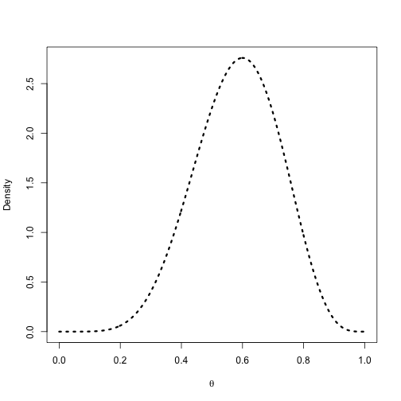
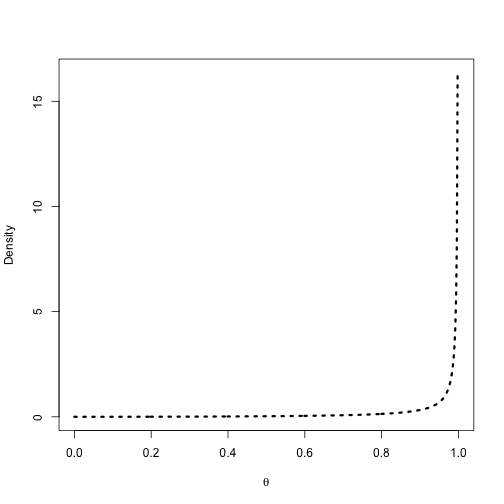
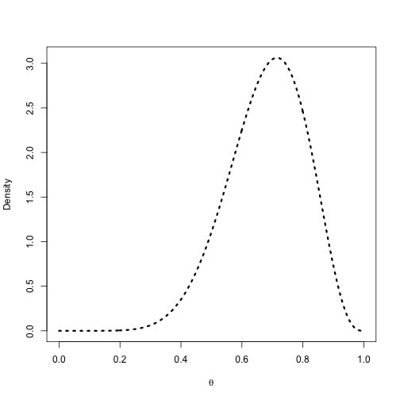
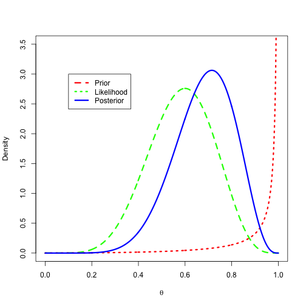

<style>
  .reveal pre {font-size: 12px;}
</style>

Introduction to Bayesian Statistics
====
author: Rebecca C. Steorts
date: 17 January 2017

Agenda
===
- Motivations
- Traditional inference
- Bayesian inference
- Bernoulli, Beta, and Binomial distributions
- Posterior of Beta-Binomial
- Example with 2012 election data
- Marginal likelihood
- Posterior Prediction

Motivations for Bayesian statistics
===
- Understanding social networks
- Predicting elections
- Estimating the size of a population
- Estimating hard to reach populations (domains)

Traditional inference
===
You are given **data** $X$ and there is an **unknown parameter** you wish to estimate **$\theta$**

How would you estimate $\theta$?

- Find an unbiased estimator of $\theta$.
- Find the maximum likelihood estimate (MLE) of $\theta$ by looking at the likelihood of the data.
- If you cannot remember the definition of an unbiased estimator or the MLE, review these before our next class.

Bayesian inference
===
Bayesian methods trace its origin to the 18th century and English Reverend Thomas Bayes, who along with Pierre-Simon Laplace discovered what we now call **Bayes' Theorem**

- $p(x \mid \theta)$  likelihood
- $p(\theta)$  prior
- $p(\theta \mid x)$ posterior
- $p(x)$ marginal distribution

$$p(\theta|x) = \frac{p(\theta,x)}{p(x)} = \frac{p(x|\theta)p(\theta)}{p(x)} \propto p(x|\theta)p(\theta)$$

Bernoulli distribution
===
The Bernoulli distribution is very common due to binary outcomes.

- Consider flipping a coin (heads or tails).
- We can represent this a binary random variable where the probability of heads is $\theta$ and the probability of tails is $1-\theta.$

The write the random variable as $X \sim \Bernoulli(\theta) \I(0 < \theta < 1)$

It follows that the likelihood is
$$p(x \mid \theta) = \theta^x (1-\theta)^{(1-x)}\I(0 < \theta < 1).$$

- Exercise: what is the mean and the variance of $X$?


Binomial distribution
===
- Suppose that $X_1,\ldots,X_n \stackrel{iid}{\sim} \Bernoulli(\theta).$ Then for $x_1,\ldots,x_n \in \{0,1\}$ what is the likelihood?

Likelihood
===
$$
\begin{aligned}
p(x_{1:n}|\theta) &= \Pr(X_1 = x_1,\dotsc,X_n = x_n\mid\theta) \notag\\
& =\prod_{i = 1}^n \Pr(X_i = x_i\mid\theta) \notag\\
& = \prod_{i = 1}^n p(x_i|\theta) \notag\\
& =\prod_{i = 1}^n \theta^{x_i}(1-\theta)^{1-x_i} \notag\\
& =\theta^{\sum x_i}(1-\theta)^{n-\sum x_i}. \label{equation:likelihood}
\end{aligned}
$$

Beta distribution
===
Given $a,b>0$, we write $\theta \sim \Beta(a,b)$ to mean that $\theta$ has pdf

$$
p(\theta) =\Beta(\theta|a,b) =\frac{1}{B(a,b)}\theta^{a-1}(1-\theta)^{b-1}\I(0<\theta<1),
$$

i.e., $p(\theta)\propto \theta^{a-1}(1-\theta)^{b-1}$ on the interval from $0$ to $1$.

- Here,
$$B(a,b) = \frac{\Gamma(\alpha)\Gamma(\beta)}{\Gamma(\alpha+\beta)}$$.
- The mean is $E(\theta) =\int \theta\,p(\theta)d\theta = a/(a+b)$.

Notation
===
- $\propto$: means "proportional to"
- $x_{1:n}$ denotes $x_1,\ldots,x_n$

Posterior of Binomial-Beta
===
Lets derive the posterior of $\; \theta \mid x_{1:n}$

$$\begin{aligned}
&p(\theta|x_{1:n})  \\
&\propto p(x_{1:n}|\theta) p(\theta)\notag\\
& =\theta^{\sum x_i}(1-\theta)^{n-\sum x_i}\frac{1}{B(a,b)}\theta^{a-1}(1-\theta)^{b-1}I(0<\theta<1) \notag\\
& \propto \theta^{a +\sum x_i - 1}(1-\theta)^{b +n-\sum x_i - 1}I(0<\theta<1)\notag\\
& \propto \textstyle Beta\big(\theta\mid a +\sum x_i, \, b + n-\sum x_i\big).
\label{equation:Beta-Bernoulli-posterior}
\end{aligned}
$$


Approval ratings of Obama
===
What is the proportion of people that approve of President Obama in PA?
- We take a random sample of 10 people in PA and find that 6 approve of President Obama.
- The national approval rating (Zogby poll) of President Obama in mid-September 2015 was 45\%. We'll assume that in PA his approval rating is approximately 50\%.
- Based on this prior information, we'll use a Beta prior for $\theta$ and we'll choose $a$ and $b.$


Obama Example
===

```r
n = 10
#center theta at 1/2 and spread at 0.04
a = 21/8
b = 0.04
th = seq(0,1, length=500)
x = 6

# we set the likelihood, prior, and posteriors with THETA as
# the sequence that we plot on the x-axis.
# Beta(c,d) refers to shape parameter
like = dbeta(th, x+1, n-x+1)
prior = dbeta(th, a, b)
post = dbeta(th, x+a, n-x+b)
```


Likelihood
===

```r
plot(th, like, type='l', ylab = "Density", lty = 3, lwd = 3, xlab = expression(theta))
```




Prior
===

```r
plot(th, prior, type='l', ylab = "Density", lty = 3, lwd = 3, xlab = expression(theta))
```



Posterior
===

```r
plot(th, post, type='l', ylab = "Density", lty = 3, lwd = 3, xlab = expression(theta))
```



Likelihood, Prior, and Posterior
===

```r
plot(th, like, type = "l", ylab = "Density", xlab = expression(theta), lty = 2, lwd = 3,
     col = "green",ylim = c(0,3.5) )
lines(th, prior, lty = 3, lwd = 3, col= "red")
lines(th, post, lty=1, lwd = 3, col= "blue")
legend(0.1,3, c("Prior", "Likelihood", "Posterior"), lty=c(2,3,1), lwd=c(3,3,3),
       col = c("red", "green", "blue"))
```



Cast of characters
===
- Observed data: $x$
- Note this could consist of many data points, e.g., $x = x_{1:n}=(x_1,\dotsc,x_n)$.

\begin{center}
\begin{tabular}{ l l }
likelihood & $p(x|\theta)$  \\
prior & $p(\theta)$ \\
posterior & $p(\theta|x)$ \\
marginal likelihood & $p(x)$ \\
posterior predictive & $p(x_{n+1}|x_{1:n})$ \\
loss function & $\ell(s,a)$ \\
posterior expected loss & $\rho(a,x)$ \\
risk / frequentist risk & $R(\theta,\delta)$ \\
integrated risk & $r(\delta)$
\end{tabular}
\end{center}

Marginal likelihood
===
The **marginal likelihood** is
$$ p(x) = \int p(x|\theta) p(\theta) \,d\theta $$

- What is the marginal likelihood for the Bernoulli-Beta?

Posterior predictive distribution
===
- We may wish to predict a new data point $x_{n+1}$
- We assume that $x_{1:(n+1)}$ are independent given $\theta$

$$
\begin{aligned}
p(x_{n+1}|x_{1:n}) &= \int p(x_{n+1},\theta|x_{1:n})\,d\theta\\
&= \int p(x_{n+1}|\theta,x_{1:n}) p(\theta|x_{1:n})\,d\theta\\
& = \int p(x_{n+1}|\theta) p(\theta|x_{1:n})\,d\theta.
\end{aligned}
$$

Example: Back to the Beta-Bernoulli
===
Suppose $$\; \theta\sim Beta(a,b)$$ and $$X_1,\dotsc,X_n\mid \theta \stackrel{iid}{\sim} Bernoulli(\theta)$$

Then the marginal likelihood is
$$
\begin{aligned}
&p(x_{1:n}) \\
&= \int p(x_{1:n}|\theta) p(\theta) \,d\theta\\
& = \int_0^1\theta^{\sum x_i}(1-\theta)^{n-\sum x_i}\frac{1}{B(a,b)}\theta^{a-1}(1-\theta)^{b-1} d\theta\\
& =\frac{B\big(a +\sum x_i,\, b + n-\sum x_i\big)}{B(a,b)},
\end{aligned}
$$
by the integral definition of the Beta function.

Example continued
===
Let $a_n = a +\sum x_i$ and $b_n = b + n-\sum x_i.$

It follows that the posterior distribution is
$p(\theta|x_{1:n}) = \Beta(\theta|a_n,b_n).$

The posterior predictive can be derived to be
$$
\begin{aligned}
\Pr(X_{n+1} = 1\mid x_{1:n}) & = \int \Pr(X_{n+1} = 1\mid \theta) p(\theta|x_{1:n}) d\theta\\
& =\int \theta\,\Beta(\theta|a_n,b_n) =\frac{a_n}{a_n + b_n},
\end{aligned}
$$
hence, the posterior predictive p.m.f. is

$$
\begin{aligned}
p(x_{n+1}|x_{1:n}) & = \frac{a_n^{x_{n+1}} b_n^{1-x_{n+1}}}{a_n + b_n}\I(x_{n+1}\in\{0,1\}).
\end{aligned}
$$


